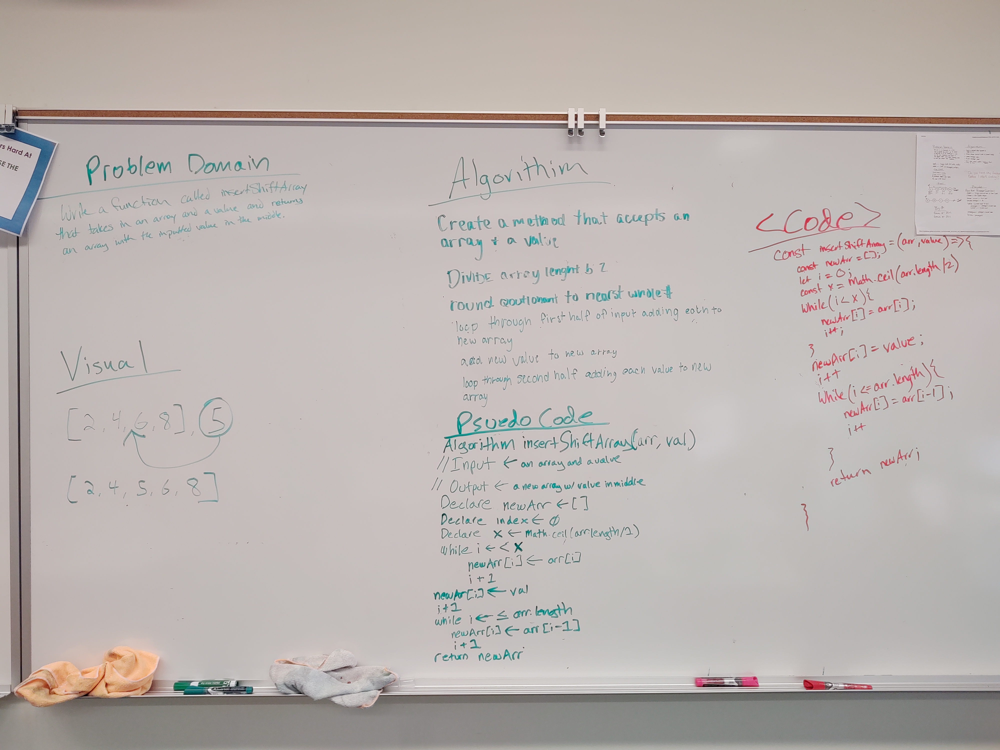

# Reverse an Array
A function that takes an array and a value and outputs a new array with the value inserted into the middle of array.

## Challenge
Write a function called insertShiftArray which takes in an array and the value to be added. Without utilizing any of the built-in methods available to your language, return an array with the new value added at the middle index.

## Approach & Efficiency
<!-- Since we were not allowed to use built-in array methods for this challenge, we discussed how to loop through the initial array and "push" its values into the new array without using the actual push method. We decided that using an incrementing counter would allow us to start the index of the new array at zero and then for each iteration through the initial array (going backwards via "i--"), we would set the value of the new array's incrementing index to the current index value of the initial array. -->

## Solution

## Collaborators
David Vloedman, Holly Davis, Travis Skyles